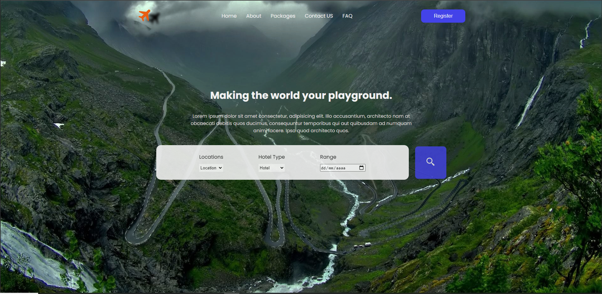
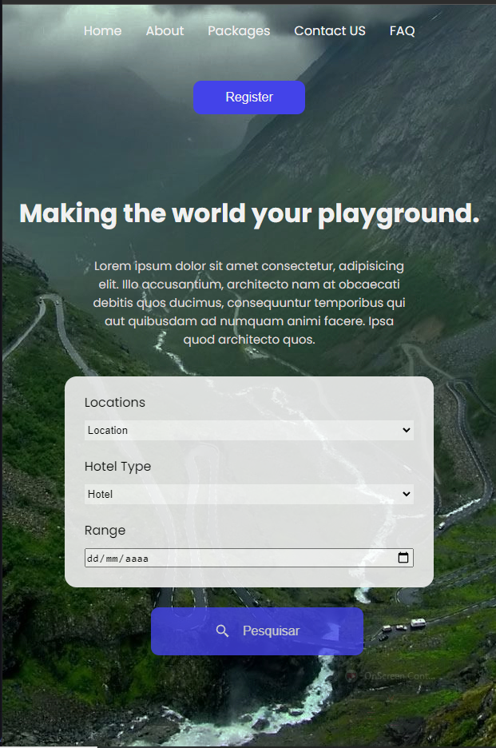

<h1 align="center">
  Rocket Travel
</h1>

<p align="center">
  <a href="#dart-sobre">Sobre</a> &#xa0; | &#xa0; 
  <a href="#rocket-tecnologias">Tecnologias</a> &#xa0; | &#xa0;
  <a href="#white_check_mark-pré-requesitos">Pré requisitos</a> &#xa0; | &#xa0;
  <a href="#checkered_flag-começando">Começando</a> &#xa0; | &#xa0;
  <a href="#projeto">Projeto</a> &#xa0; | &#xa0;
  <a href="https://github.com/GuiuRodrigues" target="_blank">Autor</a>
</p>

<p align="center">
  

  

  

</p>

<p align="center">
  
</p>

<h1> Desktop</h1>
<div align="center" id="top"> 
  
  
   
  &#xa0;

</div>
 <h1> Mobile</h1>
<div align="center" id="top"> 
 
  
</div>
<hr> 

<br>

## :dart: Sobre ##

Este é um projeto simples, onde foi criado uma landing page para aprimorar os conhecimentos e CSS e HTML, com base na [live](https://www.youtube.com/watch?v=zY3m_vEuho0&t=583s).

## :rocket: Tecnologias ##

As seguintes ferramentas foram usadas na construção do projeto:

- [HTML](https://developer.mozilla.org/pt-BR/docs/Web/HTML)
- [CSS](https://developer.mozilla.org/pt-BR/docs/Web/CSS)


## :white_check_mark: Pré requisitos ##

Antes de começar :checkered_flag:, você precisa ter o [Git](https://git-scm.com)  instalado em sua maquina.

## :checkered_flag: Começando ##

```bash
# Clone este repositório
$ git clone https://github.com/GuiuRodrigues/good-travel.git

# Entre na pasta
$ cd good-travel

# Instale as extensão no Vscode
$ Live Server

# Para iniciar o projeto
$ Open with liver server

# O app vai inicializar em seu navegador padrão
```
## 🚧 Projeto

Live Preview: https://good-travel.vercel.app/

Figma: https://www.figma.com/file/MOrKnXFQqWCz01Ei1KJnCO/Rocket-Travel

## 🎨 Inspiração:

[Dribbble](https://dribbble.com/shots/17407084-Travel-Web-Header-Landing-Page-design/attachments/12533821?mode=media)

<br>

Feito com :heart: por <a href="https://github.com/GuiuRodrigues" target="_blank">Marcos Guilherme</a>

&#xa0;

<a href="#top">Voltar para o topo</a>
